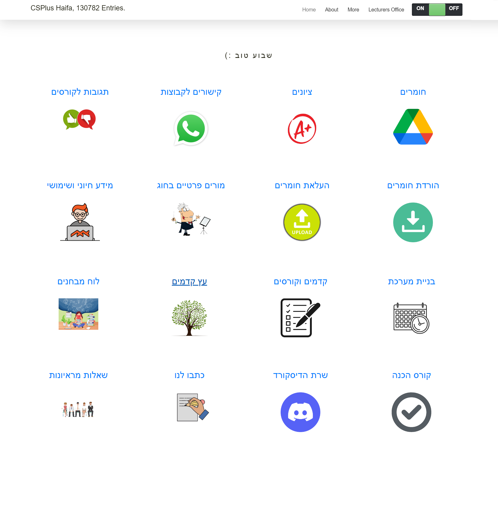

# StudentsPortal

> A site for the students in department at the university (of haifa). Includes - grades, materials, reviews, courses planner, file manager, admin panel and lots more

## Demo

[Demo](https://srworkspace.com/StudentsPortal/)

## Documentation

StudentsPortal is highly documented on the [guide](https://github.com/sharon846/StudentsPortal/demo/guide.pdf) and on Version 1.1.0 Down [here](#version-1.1.0)

## Requirements

- PHP 7.0.0 or higher.
- Fileinfo, iconv, zip, tar, mysql, pdo and mbstring extensions are strongly recommended.
- You should have domain and some hosting plan (or on your own server), with mysql databases support.
- Recommended: some grep tool. In windows: grepWin. In linux it should be default

### :loudspeaker: Features

- :cd: Open Source, light and extremely simple
- :iphone: Mobile friendly view for touch devices
- :information_source: Basic features likes Create, Delete, Modify, View, Download, Copy and Move files
- :arrow_double_up: Ajax Upload, Ability to drag & drop, upload from URL, multiple files upload with file extensions filter
- :file_folder: Ability to create folders and files
- :gift: Ability to compress, extract files (`zip`, `tar`)
- :sunglasses: Support user permissions - based on session and each user root folder mapping
- :floppy_disk: Copy direct file URL
- :pencil2: Cloud9 IDE - Syntax highlighting for over `150+` languages, Over `35+` themes with your favorite programming style
- :page_facing_up: Google/Microsoft doc viewer helps you preview `PDF/DOC/XLS/PPT/etc`. 25 MB can be previewed with the Google Drive viewer
- :zap: Backup files and IP blacklist and whitelist
- :mag_right: Search - Search and filter files using `datatable js`
- :file_folder: Exclude folders and files from listing
- :globe_with_meridians: Multi-language(32+) support and for translations `translation.json` is file required
- :bangbang: lots more...

## How to use

1. Download ZIP with latest version from master branch. Extract it.

2. Using grep, do the following replaces in all files:
   - ROOT_PATH, with the path to the main site directory. For example (of hostinger), it should be /home/u#id/domains/domain/public_html
   - DOMAIN, with your domain adress.
   - SESSION_NAME, with a session name for your choice.
     
3. Edit the file "site_manager/pdoconfig.php" Insert there your Credentials to the database.
   - If you want to change the admin user, it should be synced with more files, in few steps.

4. Upload the site your website (to the directory defined at step 2.1).
   
5. In your database admin (i.e. phpmyadmin) Import an empty database with the required tables (template is under database folder, make sure to not upload it to your site).

## # site manager
In the site manager directory which inspired by the amazing [tinyfilemanager](https://tinyfilemanager.github.io/) your have config.php. 
Default username/password: **admin/admin123** and **editor/editor123**. The admin's password is synched with the one from step 3.

:warning: Warning: Please set your own username and password in `$auth_users` before use. password is encrypted with <code>password_hash()</code>. to generate new password hash [here](https://tinyfilemanager.github.io/docs/pwd.html)

To enable/disable authentication set `$use_auth` to true or false.

:information_source: You may edit any configuration you want there. 
:information_source: The editor will be able to access the file manager, only to the site directory (where the materials drive is located). Admin has access to the entire website, including the admin's panel.

### Change Log

## Version 1.7.1:
- Added validation before uploading.
- Added deleting course option on admins grades panel.

## Version 1.7.0:
- Added autodetection of PDF files for student's validation.

## Version 1.6.5:
- Added admin mail and password for different sites.
- Added limitation for image size and shape in courses (<= 300 and squared) to comply with WhatsApp policy.

## Version 1.6.4:
- Added "image-add" option to add course directly from kdams manager.
- Added validation before creating WhatsApp data.
- Added free rooms system admin in admin's panel (which is also responsible for the scheduling system).
    - Delete previous data.
    - Upload new JSON data.
    - Create the rooms files.
    - Edit rooms list.

## Version 1.6.3:
- Added Google Calendar Export option in scheduler (aka choicefreak).
- Applied new design to the write us page.

## Version 1.6.1:
- Added forgot password form.
- Added pre-registered checking if already exists.

## Version 1.6.0:
- Added tiny folder viewer to securely view new teachers/students registered.
- Added rooms manager panel.

## Version 1.5.0:
- Added choicefreak in Haifa's version.
    - Supports both semesters A and B.
    - Supports JSON exporting and image saving.
    - Integrates with exams.

## Version 1.4.1:
- Comments are now always posted but still give admin alert.
- Questions are not always posted but still give admin alert.

## Version 1.4.0:
- Added exams scheduler visualization page.
- Fixed admin WhatsApp integration to the database.
- Added password login via MD5.

## Version 1.3.0:
- Added teacher registering page.

## Version 1.2.1:
- Changes:
    - Updated admin mailing list.
    - Added option to register users in year 0 (not in 1st year yet).
    - Admin can change globally lecture names in kdams page.
    - Fixed minor errors on kdams editing.

## Version 1.2.0:
- Changes:
    - Added CV make page.
        - Supports Hebrew or English CV.
        - Students will get an online link to add their CV.

## Version 1.1.1:
- Changes:
    - Added About page.
    - Global UI fixes.

## Version 1.1.0: {#version-1.1.0}
## Homepage
- Loading the "menu" of the site from the database.
- Support log count.
- Displaying messages from admin.
- Support dark mode.

## Login
- Confirm using the database that email is a real student.
- Non-existing students can request registration.

## Materials
- Protected by login.
- Beautiful display of files and folders, size, and date.
- Support dark mode.
- Search bar within all files and folders, recursively.
- Showing current directory; each level is clickable.

## Materials-upload
- Drag and drop files, support for large files.
- Support assigning to a specific course.
- Support dark mode.
- Only admin has access to uploaded data.

## Grades
- Protected by login.
- Display grades from the database, by lecture/course.
- Grades are sorted by year (high to low), semester (first to last), moed (first to last).
- Display statistics on data amount.
- Support dark mode.

## Grades-upload
- Supports uploading grades from the last 4 semesters.
- Support assigning to a specific course.
- Only admin has access to uploaded data.

## Comments
- Protected by login.
- Supports adding new feedback requests (e.g., new lecture with its specific course) that do not exist yet.
- Support dark mode.
- Support filtering by different course types.
- Support filtering by lecture/course.
- Users in the database can also edit and delete their comments.
- Users can add comments with anonymous display name (admin knows their identity).
- Each post or comment can be ranked.

## Teachers
- Support log count.
- Support dark mode.
- Support filtering by teacher/course.
- Each teacher can be ranked.

## Write-us
- Beautiful demo Google form, users can write messages that will be saved on the site.
- Only admin has access to messages.

## WhatsApp
- Protected by login.
- Support dark mode.
- Can filter by year/semester.
- Loading links, name, lectures from the database.
- Loading thumbnails from local archive.

## Kdams
- Support dark mode.
- Can add "year1" and "year2" courses, which include all courses recommended in the first year.
- Completed courses are chosen from the autocomplete detector list and can be deselected later.
- Generates all courses that are available after completing the given list and provides collected points.
- Each next course gives a link to the catalog and has details of lecture, points, type, and notes.
- Support adding next courses to the completed list for further simulations.
- Support checking required courses to achieve a specific course.
- Support checking what courses a specific course leads to.
- Support Kdams tree, which visually demonstrates the relationship between courses.

## Rooms
- Given day and hour, outputs all free rooms.
- Support backdoor, enter 'sharon' in hours.

### ADMIN

## Updates
- Each update has its relevant link to handle it.
- By clicking "v", disposes of the update alert.
- Updates from actions:
    - Uploaded materials.
    - New student tried to register.
    - Uploaded grades.
    - Added question or comment.
    - Someone wrote admin.

## Grades
- By choosing year, semester, lecture, and course, can edit grades (or insert new ones) with notes and by the course type.
- Direct integration with the database, all automated.

## Users
- Supports increment of students' study year (according to the database).
- Support view and edit students' data in the database.
- Supports adding new students in special cases (like registration requests).
- Support getting a mailing list of students.

## Lectures, Courses
- Can directly edit the list of all lectures or courses in the system.

## Messages
- Directly edit the messages that appear on the main page of the site.

## Kdams
- By clicking on a year, can edit the current year.
- Generated editable kdams list directly from the database.
- Can remove a course or add a new one at the bottom.
- Supports global changing of course names.
- Support generating WhatsApp links.

## License, Credit

- Available under the [GNU license](https://github.com/prasathmani/tinyfilemanager/blob/master/LICENSE)
- Original concept and development by github.com/alexantr/filemanager
- CDN Used - _jQuery, Bootstrap, Font Awesome, Highlight js, ace js, DropZone js, and DataTable js_
- To report a bug or request a feature, please file an [issue](https://github.com/prasathmani/tinyfilemanager/issues)
- [Contributors](https://github.com/prasathmani/tinyfilemanager/wiki/Authors-and-Contributors)
